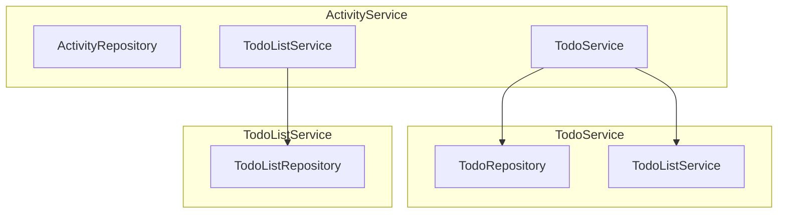

# Event Listener

스프링 프로젝트에 테스트를 작성중 테스트를 작성하기 매우 곤란하게 느껴졌다.

ActivityService.createActivity()메소드가 private이기때문에 스터빙이 어려웠기 때문인데.
```java
private <T extends Do> Activity createActivity(T a, ActivityType type) {
        Activity activity = Activity.builder()
                .type(type)
                .refId(a.getId())
                .timeStamp(LocalDateTime.now())
                .build();
        return activityRepository.save(activity);
    }

    public Activity addTodoActivity(Long todoId, ActivityType type) {}

    public Activity addTodoListActivity(Long listId, ActivityType type){}
```
Activity는 모든 행위에 대한 부가기능으로 여러 엔티티의 동작에 대한 로그/히스토리 를 남기기위한 엔티티이다.<br>활동기록에 남길 수 있는 엔티티를 Do엔티티를 상속받도록 한 후 제네릭을 이용해 인자로 받을 엔티티를 제한하고, 이후 확장해 나갈 때 마다 엔티티는 Do를 상속받도록하고 add(추가된 엔티티)Activity()만 생성하면 간편할 것이라 생각하여 이러한 방식을 사용했다.

테스트 코드를 작성하는 과정에서 구조적인 문제가 있다고 느끼게 되었고 서비스 패키지에 대한 피드백을 받아, 액티비티를 남기는 것은 트랜잭션으로 묶일 필요가 없으니 분리하여 서비스가 서비스를 바라보지 않도록, 장기적으로 단순해 질 수 있도록 이벤트를 발행/소비하여 처리하도록 할 것을 권유 받았다.

> main/java/org/example/newdiary/service/ActivityService

위 도표에서 나타 나듯이 서비스가 서비스를 바라보고 있다.

이를 개선하기위해 이벤트 리스너를 알아보고 사용해 보려한다.
## [Application Events를 이용해 작업하기](https://docs.spring.io/spring-modulith/reference/events.html)
application module들이 서로 가능한 한 느슨하게 결합되도록 유지하기 위해, 그들의 주요 상호작용 수단은 이벤트 발행과 소비여야 한다. 이것은 원래의 모듈이 모든 잠재적으로 관심 있는 당사자들에 대해 알지 못하도록 하며, 이는 응용 프로그램 모듈 통합 테스트를 가능하게 하는 핵심적인 측면이다.
### 이벤트
### 이벤트 퍼블리셔
### 이벤트 리스너