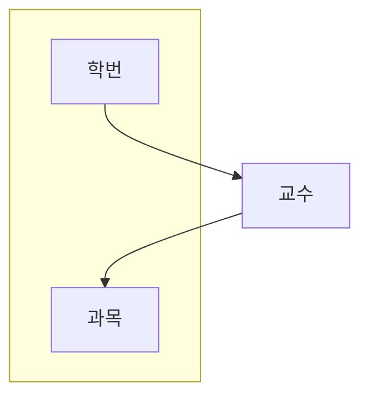

# 데이터 모델과 성능

## 정규화와 성능

### 1) 성능 데이터 모델링의 개요

#### 성능 데이터 모델링의 개념

- 성능 데이터 모델링은 분석/설계 단계부터 데이터베이스 성능을 고려한 데이터 모델링을 수행하는 기법
- SQL이 아닌 데이터 모델을 중심으로 성능에 대한 데이터 모델링을 수행한다.


#### 성능 데이터 모델링의 절차

- 논리 모델링 단계에서는 데이터베이스 정규화를 수행한다.
- 물리 모델링 단계에서는 용량산정과 트랜잭션 유형 파악을 통해 반 정규화를 수행하고, 이력 유형, PK/FK 순서, 슈퍼 타입/서브 타입을 통해 데이터 구조를 조정한다.

| 순서 |        절차        | 설명                                            |
| ---- | :----------------: | :---------------------------------------------- |
| 1    |       정규화       | 데이터 중복을 제거하여 데이터 처리 성능을 향상  |
| 2    |      용량산정      | 데이터베이스의 현재 용량과 예상 증가량을 조사   |
| 3    | 트랜잭션 유형 파악 | 데이터의 분할 및 조인 여부 조사                 |
| 4    |      반정규화      | 테이블, 컬럼, 관계에 대해 반정규화 수행         |
| 5    |  데이터 구조 조정  | 이력 유형, PK/FK 순서, 슈퍼 타입/서브 타입 조정 |
| 6    |  데이터 모델 검증  | 성능 관점에서 데이터 모델을 검증                |

### 2)데이터베이스 정규화

#### 데이터베이스 정규화(DB Normalization)의 개념

- 데이터베이스 정규화는 관계형 데이터 모델에서 데이터의 `중복성을 제거`하여 이상 현상을 방지하고 데이터의 일관성을 유지하기 위해 `무손실 분해`하는 과정이다.
- 함수적 종속성(Functional Dependency)의 성질을 이용해서 데이터베이스 정규화를 수행한다.

#### 함수적 종속성(Functional Dependency)

> 데이터베이스의 릴레이션 R(테이블)에서 X와 Y를 R의 부분집합이라고 할 때, X의 값 각각에 대해 Y의 값이 오직 하나로 결정 될때 Y는 X에 종속 된다고 한다.

- 함수적 종속성은 데이터가 가지고 있는 속성 간의 관계에 의해 결정되고 종속되는 현상이다.
- 데이터의 기준 값을 결정자(Determinant)라고 하고, 종속되는 값을 종속자(Dependent)라고 한다.


##### 함수적 종속성의 예시


##### <span style="font-size:24px;">함수적 종속성의 유형</span>

- 완전 함수 종속성 : 식별자의 전체 속성이 다른 속성을 결정하는 경우
  |학생ID|과목코드|성정|
  |-|-|-|
  | 1001 | CS101 | A |
  | 1002 | CS102 | B |
  | 1003 | CS101 | A |
  | 1004 | CS103 | C |
  ```mermaid
  classDiagram
  class 학생 {
      학생ID
      과목코드
      성적
  }
  ```
  학생ID와 과목코드가 복합 기본 키일 때, 성적은 학생ID와 과목코드 전체에 의해 결정된다.<br>여기서 성적은 완전 함수 종속성을 가집니다.
  ```mermaid
  graph LR

      a["학생ID, 과목코드"] --> 성적
  ```
- 부분 함수 종속성 : 복합 식별자의 일부 속성이 다른 속성을 결정하는 경우
  | 학생ID | 과목코드 | 교수명 |
  |-|-|-|
  | 1001 | CS101 | 김교수 |
  | 1002 | CS102 | 이교수 |
  | 1003 | CS101 | 김교수 |
  | 1004 | CS103 | 박교수 |
  ```mermaid
  classDiagram
      class 학생 {
          학생ID
          과목코드
          교수명
      }
  ```
  학생ID와 과목코드가 복합 기본 키일 때, 교수명은 과목코드에 의해 결정된다.<br>즉, 학생ID만으로는 교수명을 결정할 수 없기 때문에, 교수명은 과목코드의 부분 종속성을 가진다.
  ```mermaid
  flowchart LR
      subgraph a[" "]
          st["학생ID"]
          s["과목코드"]
      end
      s --> 성적
      a --> 성적
  ```
- 이행 함수 종속성 : 어떤 속성 A가 다른 속성 B를 결정하고, B가 또 다른 속성 C를 결정하는 경우
  | 학생ID | 전공명 | 교수명 |
  |-|-|-|
  | 1001 | 컴퓨터공학 | 김교수 |
  | 1002 | 전자공학 | 이교수 |
  | 1003 | 컴퓨터공학 | 김교수 |
  | 1004 | 기계공학 | 박교수 |

  ```mermaid
  graph LR
    학생ID --> 전공명 --> 교수명
  ```
- 결정자 함수 종속성 : 결정자가 후보키가 아닌 일반 속성일 때의 함수 종속성. 즉, 후보키가 아닌 속성이 다른 속성을 결정하는 경우

#### 데이터베이스 정규화 단계
데이터베이스 정규화는 함수적 종속성에 근거해서 수행한다
1. 1차 정규화 : 테이블 내의 속성값을 원자값으로 구성하는 단계
    |이름|이메일주소|
    |:-:|:-:|
    |홍길동|hong@sqld.net; gildong.hong@sqld.net|

    이메일 주소 속성에 2개의 중복되는 값이 존재한다. 속성을 원자값으로 구성하기위해 2개의 이메일 주소를 각각 레코드로 구성한다.

    |이름|이메일주소|
    |:-:|:-:|
    |홍길동|hong@sqld.net|
    |홍길동|gildong.hong@sqld.net|
2. 2차 정규화 : 부분 함수 종속성을 제거하는 단계, 일반 속성은 모두 완전 함수적 종속성 관계
    |학생|과목|담당교수|
    |:-:|-|-|
    |홍길동|데이터베이스|이순신|
    |장보고|데이터베이스|이순신|
    |허 준|소프트웨어 공학|스티브|
    
    //TODO : 그림 그리는것에 시간 너무 소요 나중에 채우며 재정리해보기
3. 3차 정규화 : 이행 함수 종속성을 제거하는 단계
4. BCNF(Boyce-Codd Normal Form) : 결정자 함수 종속성을 제거하는 단계
### 3)데이터베이스 정규화의 성능 고려사항
- 정구화를 하면 데이터 처리 조건에 따라 성능이 향상될 수도 있지만 반대로 저하될 수도 있다.
- 정규화로 인해 조인이 증가하는 경우에는 데이터 조회 성능이 저하될 수 있다.
- 데이터 조회와 입력/수정/삭제의 성능이 Trade-Off 되어 발생하기도 한다.

|처리유형|고려사항|
|:-:|-|
|조회|- 데이터 처리조건에 따라, 성능이 다르게 나타남<br>- 단일 테이블 조회시, 데이터 중복이 제거되어 조회 성능이 향상됨<br>- 다수의 테이블을 조인하여 조회하는 경우에는 I/O증가와 조인 연산으로 조회성능이 저하되기도 함|
|입력, 수정, 삭제|데이터 중복이 제거되어, 일반적으로 성능이 향상됨|